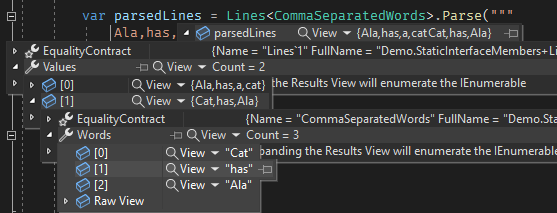

C# 8.0 gave us [default interface methods](https://learn.microsoft.com/en-us/dotnet/csharp/language-reference/proposals/csharp-8.0/default-interface-methods). They brought us, among other things, the way to introduce new API members without breaking current contracts. Interfaces however still lacked a ability to model "static" members out-of-the-box. Factories became our usual way of dealing with object creation but how about functionalities that class itself knows best how to handle. What about, say, parsing? Enter C# 11's Static Interface Members

## Parsing
Let's examine the following example:
``` csharp
public interface IMyParsable<TSelf>
    where TSelf : IMyParsable<TSelf>?
{
    static abstract TSelf Parse(ReadOnlySpan<char> s, IFormatProvider? provider);
}        
```
First that strikes to mind is "what do we need such generic guard here?". Read more on [Curiously Recurring Generic Pattern](https://blog.stephencleary.com/2022/09/modern-csharp-techniques-1-curiously-recurring-generic-pattern.html). 

It get's a little tricky to use Curiously Recurring Generic Pattern correctly to the point that even special syntax [was proposed for it](https://github.com/dotnet/csharplang/issues/4436#issuecomment-896981841) but none of these proposals were championed. For now, do not worry about it, just do not copy and paste such code like there is no tomorrow. 


Rest of the example seems reasonable - this states that types implementing this interface must also contain static _Parse_ method. This method can be used inside interface itself:

``` csharp
public interface IMyParsable<TSelf>
    where TSelf : IMyParsable<TSelf>?
{
    static abstract TSelf Parse(ReadOnlySpan<char> s, IFormatProvider? provider); //provide implementation in implementing types 

    // this member does not seem to benefit much from being override-able 
    // so "virtual" modifier is omitted intentionally
    static TSelf InvariantParse(ReadOnlySpan<char> s) => 
        TSelf.Parse(s, CultureInfo.InvariantCulture);  

    //provide standard *Parse methods implementation 

    static virtual TSelf Parse(string s, IFormatProvider? provider) =>
        TSelf.Parse(s.AsSpan(), provider);

    static virtual bool TryParse([NotNullWhen(true)] string? s, IFormatProvider? provider, 
        [MaybeNullWhen(false)] out TSelf result)
    {
        result = default;
        if (s == null) return false;

        try
        {
            result = TSelf.Parse(s.AsSpan(), provider);
            return true;
        }
        catch (Exception)
        {
            return false;
        }
    }

    static virtual bool TryParse(ReadOnlySpan<char> s, IFormatProvider? provider, 
        [MaybeNullWhen(false)] out TSelf result)
    {
        try
        {
            result = TSelf.Parse(s, provider);
            return true;
        }
        catch (Exception)
        {
            result = default;
            return false;
        }
    }
}       
```


Let's implement a simple class that will encapsulate notion of words that can be serialized in string separated with commas

``` csharp
record CommaSeparatedWords(IReadOnlyList<string> Words) : IMyParsable<CommaSeparatedWords>
{
    public static CommaSeparatedWords Parse(ReadOnlySpan<char> s, IFormatProvider? provider)
    {
        var words = new List<string>();
        foreach (var word in s.Split(','))
            words.Add(word.ToString());

        return new(words);
    }

    public override string ToString() => string.Join(",", Words);
}
``` 

_CommaSeparatedWords_ record will have other _Parse_ and _TryParse_ methods but calling them directly will not be possible i.e. `CommaSeparatedWords.TryParse(...)`. So how can one effectively use them? Answer remains in generic guards. This class will parse line contents while delegating line parsing to _CommaSeparatedWords_:

``` csharp
record Lines<T>(IReadOnlyList<T> Values) : IMyParsable<Lines<T>>
    where T : IMyParsable<T>
{
    public static Lines<T> Parse(ReadOnlySpan<char> s, IFormatProvider? provider = null)
    {
        var splitText = s.EnumerateLines(); 

        var lines = new List<T>();

        foreach (var line in splitText)
            lines.Add(T.Parse(line, provider));

        //this also works in this context
        //var canParse = T.TryParse("", provider, out var result);

        return new(lines);
    }

    public override string ToString() => string.Join(Environment.NewLine, Values);
}
``` 

So the following code will properly parse 
``` csharp
var parsedLines = Lines<CommaSeparatedWords>.Parse("""
    Ala,has,a,cat
    Cat,has,Ala
    """);
``` 
as can be seen here:



## Static Interface Members in standard library 

One can assume that parsing is such important feature that appropriate interface should exist in standard library. It does, in 2 flavours in fact:
- [IParsable<TSelf>](https://learn.microsoft.com/en-us/dotnet/api/system.iparsable-1?view=net-7.0)
- [ISpanParsable<TSelf>](https://learn.microsoft.com/en-us/dotnet/api/system.ispanparsable-1?view=net-7.0)

with later obviously extending the former. One can check, but most, if not all (with notable exception of __bool__), common types like __int__, __float__, __byte__ already implement both of these interfaces. 

This in turn allows us to use them a generic guards to implement a [CSV](https://en.wikipedia.org/wiki/Comma-separated_values) parser for lines with 3 constituents and a class that will store/parse whole CSV file: 

``` csharp
readonly record struct CsvLine<T1, T2, T3>(T1 Item1, T2 Item2, T3 Item3) 
    : ISpanParsable<CsvLine<T1, T2, T3>>
     where T1 : ISpanParsable<T1>
     where T2 : ISpanParsable<T2>
     where T3 : ISpanParsable<T3>
{
    public static CsvLine<T1, T2, T3> Parse(ReadOnlySpan<char> s, IFormatProvider? provider = null)
    {
        // For some reasons ReadOnlySpan<char> does not possess a string.Split() equivalent. 
        // This example uses the SpanSplit approach from:
        // https://www.nuget.org/packages/Nemesis.TextParsers/
        var enumerator = s.Split(',').GetEnumerator();
        if (!enumerator.MoveNext()) throw new("No element at 1st position");
        var t1 = T1.Parse(enumerator.Current, CultureInfo.InvariantCulture);

        if (!enumerator.MoveNext()) throw new("No element at 2nd position");
        var t2 = T2.Parse(enumerator.Current, CultureInfo.InvariantCulture);

        if (!enumerator.MoveNext()) throw new("No element at 3rd position");
        var t3 = T3.Parse(enumerator.Current, CultureInfo.InvariantCulture);

        return new(t1, t2, t3);
    }

    //remaining Parse methods omitted for brevity
}

record CsvFile<T>(IReadOnlyList<T> Lines) : ISpanParsable<CsvFile<T>>
    where T : ISpanParsable<T>
{
    public static CsvFile<T> Parse(ReadOnlySpan<char> s, IFormatProvider? provider = null)
    {
        var splitText = s.EnumerateLines();

        var lines = new List<T>();

        foreach (var line in splitText)
            lines.Add(T.Parse(line, provider));

        return new(lines);
    }

    //remaining Parse methods omitted for brevity
}
``` 
This will allow parsing to be done in following fashion:

``` csharp
var parsedNumbers = CsvFile<int>.Parse("""
    11
    22
    33
    """);

//or more advanced example
var parsedStructs = CsvFile<CsvLine<int, float, char>>.Parse("""
    11,1.1,A
    22,2.2,B
    33,3.3,C
    """);
``` 


## Sources 
- [Static Interface Members](https://gist.github.com/MichalBrylka/faf99aed6a2c307a5cb9f763bed5e241)
